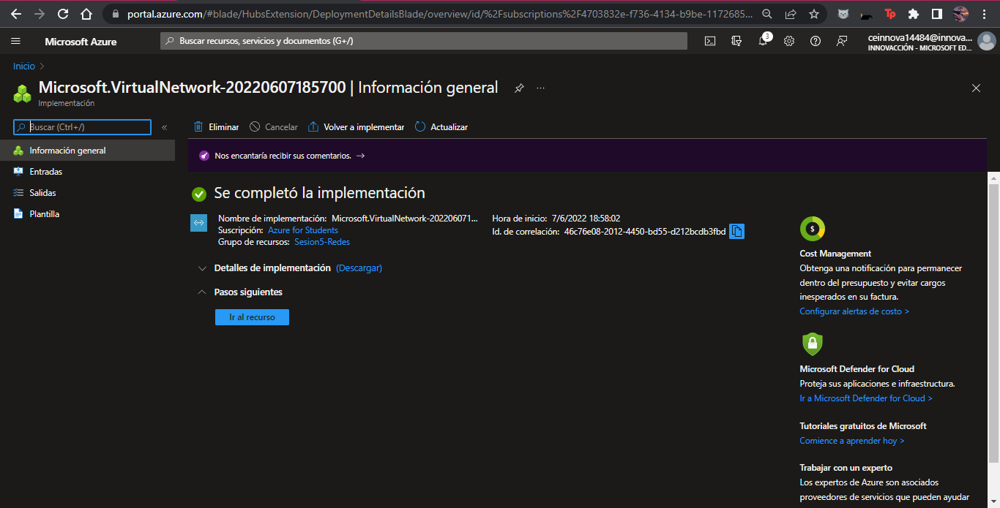
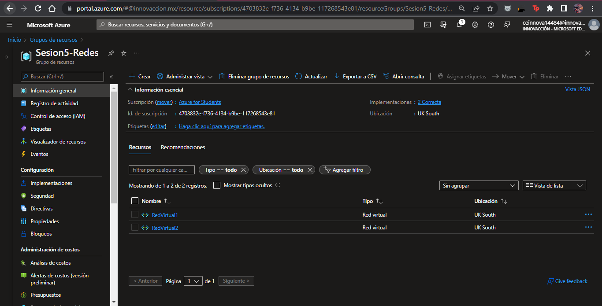
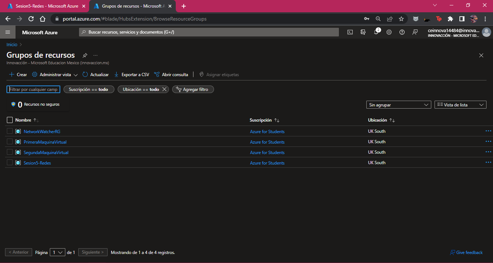
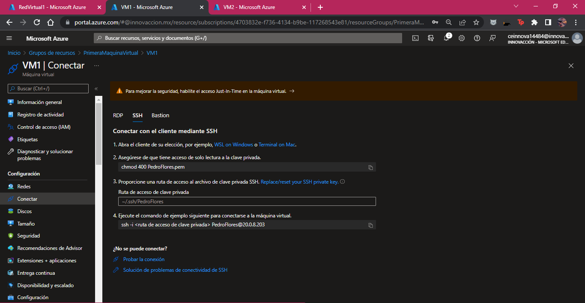
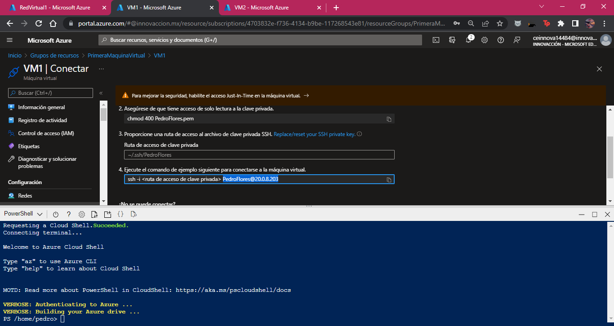
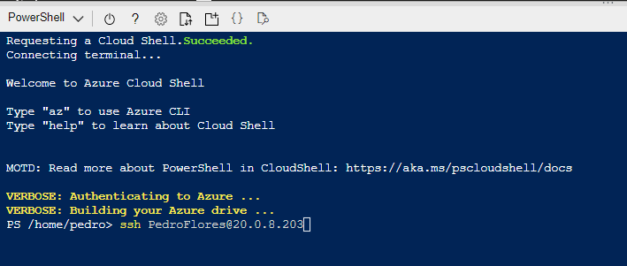
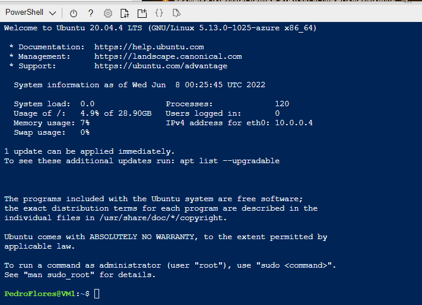
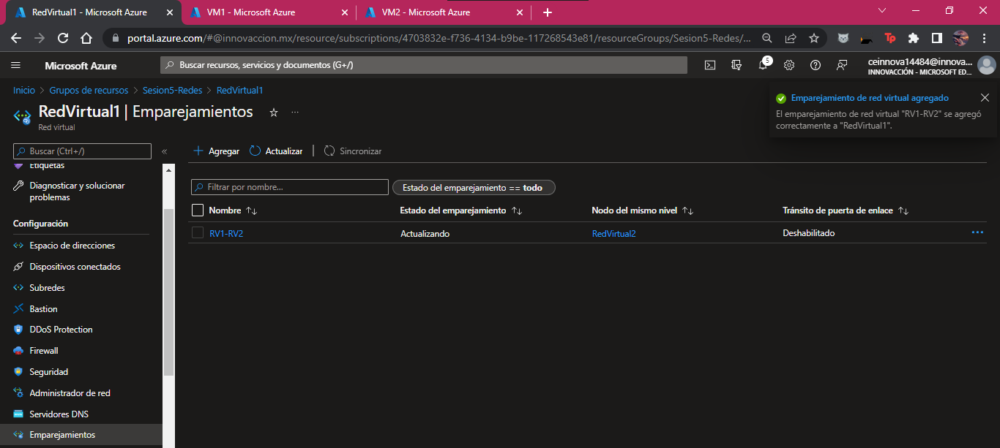
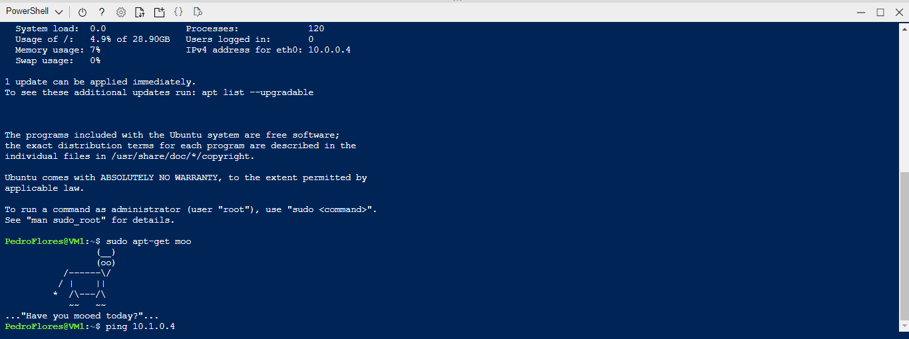
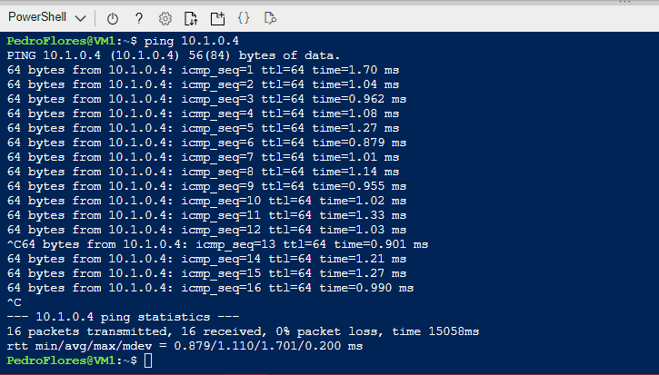

# Redes en Azure

En esta sesion aprendimos sobre los componentes que conforman la red de Azude y los diversos servicios que posee respecto a esta.

Uno de los principales servicios de red de Azure es _Azure Virtual Network_, el cual permite la comunicacion entre diversos recursos de Azure, un enrutamiento de trafico de red y el filtrado de traáfico del mismo.
Un ejemplo del uso de este servicio es la conexion de Maquinas virtuales entre sí, de lo cual se tratará la practica de esta sesión.

### Practica: Conexion de Dos Maquinas Virtuales

Para iniciar con la practica, primero debemos crear dos redes virtuales dentro de un grupo de recursos, las cuales se alojarán en la misma región que las maquinas virtuales.

A continuacion debemos de crear dos redes virtuales, las cuales contaran con un OS Ubuntu (Linux), y serán creadas en la misma region que las redes para que pueda existir una conexion directa.

Ahora entramos a la primera maquina virtual "VM1" y en el apartado de recursos debemos acceder a la pestaña de _Conectar_.

En la parte superior, se encuentra el icono de Azure Cloud Shell, el cual sirve para administrar la nube de Azure usando comandos. Accedemos al apartado anterior, y colocamos el codigo

>ssh < ruta de acceso de la clave privada >

Presionamos la tecla enter y comenzará el proceso de conexion. Una vez terminado el proceso, aparecera que esta conectado la VM1.

A continuacion tenemos que realizar una conexion entre redes. Para eso, nos dirigimos al apartado "Emparejamiento" de la pestaña de recurso de la primera red virtual, y agregar un emparejamiento.

Una vez conectadas, hacer una prueba de ping para comprobar que existe una conexion entre redes.

Se debe realizar con el comando:

> ping < IP de la VM2 >

Si la prueba de ping resulta exitosa, significa que la practica fue exitosa y hubo uno conexion entre redes.

Con esto concluyo la practica del día.

